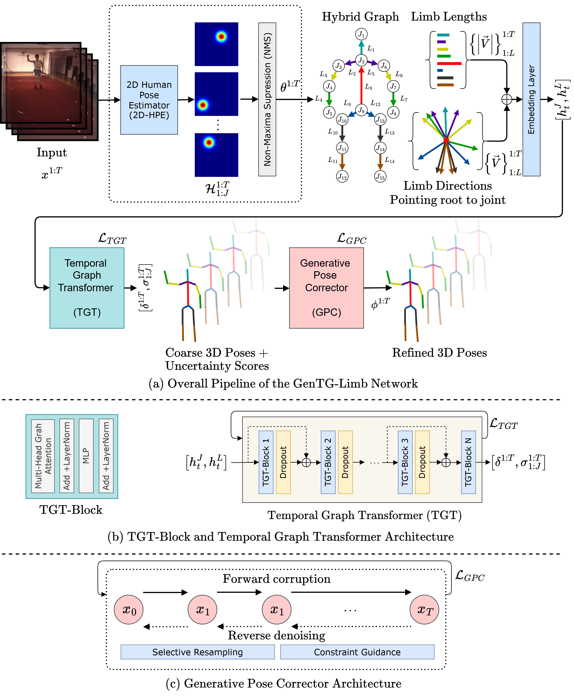
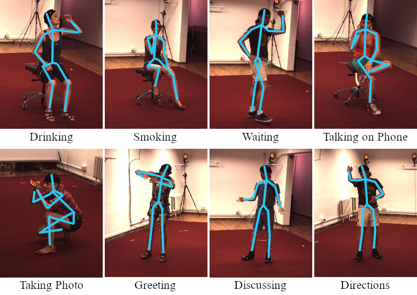

# GenTG-Limb (PyTorch)

A reference implementation of **GenTG-Limb** — a prior-free monocular 3D human pose pipeline that combines a **Temporal Graph Transformer (TGT)** with a **Generative Pose Corrector (GPC)** based on diffusion.

> Pipeline: Video → 2D keypoints → **TGT** (coarse 3D + uncertainty) → **GPC** (selective diffusion correction) → final 3D sequence.




## Features
- Joint+limb tokenization with relative temporal attention
- Multi-loss training: reprojection, MPJPE, limb-length smoothness, L/R symmetry
- Diffusion-based **selective** correction guided by uncertainty
- Modular configs, clean scripts, metrics & tests, export to ONNX/TorchScript

## Install
```bash
# (Optional) conda env
conda create -n gentg python=3.10 -y && conda activate gentg

# Install PyTorch (choose CUDA build you need)
# See https://pytorch.org/get-started/ for the exact command for your system
pip install -r requirements.txt
```

> Note: For **torch-geometric** on CUDA, follow the official wheel instructions if pip resolves a CPU-only build on your system.

## Quickstart
Prepare datasets (see `data/README.md`), then train TGT:
```bash
python scripts/train_tgt.py --config configs/train/tgt_base.yaml
```

Train GPC conditioned on saved TGT predictions:
```bash
python scripts/train_gpc.py --config configs/train/gpc_base.yaml
```

Optional end-to-end finetuning:
```bash
python scripts/finetune_e2e.py --config configs/train/e2e_finetune.yaml
```

Run inference on a sequence:
```bash
python scripts/infer.py --config configs/infer/offline_seq.yaml --input path/to/seq.npz
```

## Repo structure
See the root-level scaffold for directories. Each module has docstrings and unit tests under `tests/`.



## Citation
```
@inproceedings{memon2025gentglimb,
author = {Anam Memon and Qasim Ali Arain and Nasrullah Pirzada and Muhammad Akram Shaikh and Ali Asghar Manjotho},
title = {GenTG-Limb: Generative Temporal Graph Transformers for Prior-Free 3D Human Pose},
title = {1st International Conference on Innovations in Information and Communication Technologies (IICT'26), Jan 15-17, 2026},
year = {2026}
}
```

## License
This code is distributed under an [MIT LICENSE](LICENSE).

